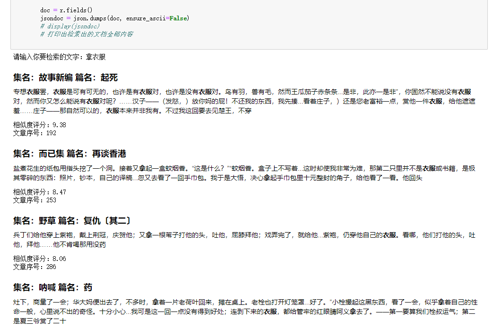

# LuXun-Search
# [鲁迅说过的话](https://github.com/Ginchung/LuXun-Search) 单机检索程序
By Ginchung@Github

## License
MIT

## Dependencies
Python3 Platform
[Whoosh](https://whoosh.readthedocs.io/en/latest/)(检索)

[Jieba](https://github.com/fxsjy/jieba)(用于分词)

[Ac-heron收集的鲁迅文集](https://github.com/Ac-heron/luxun)

Welcome to STAR ME!

# 用法
- 安装需要的模块：`pip install -r requirements.txt`
- 需要运行的文件位于目录`src`中：`cd src`
- 强烈推荐：用Jupyter Notebook运行luxun.ipynb：`jupyter notebook`，并且打开`luxun.ipynb`，按照注释运行
- 或者：首先打开里面的makeIndex.py构建索引(`python makeIndex.py`)，之后运行search.py查询(`python search.py`)

# 结果图

# Reference
[python轻量级中文搜索whoosh](https://cloud.tencent.com/developer/article/1374967)

